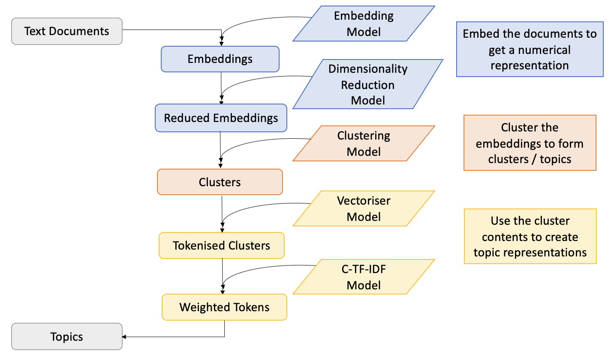

```{r, include = FALSE}
knitr::opts_chunk$set(
  collapse = TRUE,
  comment = "#>"
)
```

```{r setup, message = FALSE}
library(BertopicR)
library(dplyr)
```

# Modules

In the [Bertopic Python Library](https://maartengr.github.io/BERTopic/getting_started/quickstart/quickstart.html) by Maarten Grootendorst there are 6 sub-modules:

   1.  <span style="color:#4472C4">Embeddings</span> - for transforming your documents into a numerical representation
   
   2. <span style="color:#4472C4">Dimensionality Reduction</span> - for reducing the number of features of the embeddings output

   3. <span style="color:#ED7D31">Clustering</span> - finding groups of similar documents to represent as topics
   
   4. <span style="color:#FFC000">Vectorisers</span> - find the n-grams to describe each topic
   
   5. <span style="color:#FFC000">c-TF-IDF</span> - create topic-level (rather than document) bag of words matrices for representing topics
   
   6. Fine-tuning topic representations - other tools for topic representations (includes generative AI/LLMs), you can read more about this in the [Manipulating the Model](manipulating-the-model.Rmd) vignette.

```{r, echo = FALSE}

# 
```

This vignette will show you how to use {BertopicR} to tune each module when creating your topic models.

## Data

For demonstrative purposes, we'll use {stringr}'s 'sentences' data set, which comes fairly clean. For help on cleaning text data visit ParseR/LimpiaR documentation. Let's take a look at the first five posts for brevity.

```{r}
sentences <- stringr::sentences
sentences[1:5]
```

Then we'll turn the sentences into a data frame:

```{r}
df <- dplyr::tibble(sentences = tolower(sentences))
```

## Embeddings

In order to work efficiently with text data, we need to turn the words into numbers. The current state-of-the-art approach to turning text into numbers, is contextualised word embeddings. We'll use an MpNet model, 'all-mpnet-base-v2' to take our sentences and turn them into numbers (embeddings). This will allow us to find similarities and differences between our sentences, using standard mathematical techniques (don't worry if this isn't making sense right now, often the best way to learn is by doing).

In BertopicR you will usually either want to be making or doing with modules, or, compiling or fitting with models. We make components, we do actions on data with components. We compile our components into models, and then we fit our models to data.

### Make the embedder

First we'll make an embedder (or embedding_model) using the `bt_make_embedder_st` function. Then we'll embed our sentences using the embedder.

TIP: It's a good idea to save your embeddings, as when working with many documents this process will be time consuming.

```{r}
embedder <- BertopicR::bt_make_embedder_st(
  model = "all-mpnet-base-v2",
  accelerator = NULL
  )
```

### Do the embedding

```{r}
embeddings <- bt_do_embedding(
  embedder,
  df$sentences
  )

embeddings[1, 1:10]
```

Each row of our embeddings output represents one of our original sentences, and each column represents a different embedding dimension; there are 768 dimensions outputted by the 'all-mpnet-base-v2' mode

We take a peek at the first 10 columns (dimensions), of the first row of our embeddings and we see 10 floating point numbers.

## Reducing Dimensions

The next step in the pipeline is to reduce the dimensions of our embeddings, we do this for two reasons:

1.  to allow our clustering algorithm to run smoothly

2.  to visualise our clusters on a plane (we will eventually reduce to 2 dimensions)

In machine learning more generally, dimensionality reduction is often an important step to avoid overfitting and the curse of dimensionality. In this example we will use the UMAP algorithm (however dimensionality reduction using PCA and truncatedSVD are also currently available) for more information on the UMAP algorithm - uniform manifold approximation and projection for dimension reduction - *catchy*, see [UMAP Docs](https://umap-learn.readthedocs.io/en/latest/).

TIP: Like with embeddings, it's a good idea to save your reduced embeddings, as reducing dimensions can be a costly process.

### Make the reducer

We'll use a low-ish value for n_neighbours (we have a small dataset) and an output with 5 dimensions (n_components = 5L). We'll set the min_distance to 0, so that our dimensionality reduction model can place very similar documents *very* close together. We'll set the metric to "Euclidean" see [Embedding to non-Euclidean Spaces](https://umap-learn.readthedocs.io/en/latest/embedding_space.html) for alternatives.

```{r}
reducer <- bt_make_reducer_umap(
  n_neighbours = 10L,
  n_components = 5L,
  min_dist = 0L,
  metric = "euclidean"
  )
```

### Do the reducing

```{r}
reduced_embeddings <- bt_do_reducing(
  reducer, embeddings = embeddings
)

reduced_embeddings[1:2, ]
```

We'll take a peek at two of our rows which now represent the reduced dimension embeddings for each document. Notice that our numbers are floating points, but also that they are not bounded between -1 and 1.

The next step is to cluster our data. On a first pass, bertopic considers each discovered cluster a topic. Choice of clustering model and the selected parameters are therefore important. We'll use an hdbscan cluster, as that's what bertopic was initially built with.

## Clustering

There is a lot to learn when it comes to clustering, and selecting the correct parameters is notoriously difficult - especially when clustering without pre-assigned labels, as *most* clustering tends to be. For this run we'll use the hdbscan clustering algorithm, because we don't know how many clusters we should look for in advance (which we should if using kMeans clustering for example).[hdbscan documentation](https://hdbscan.readthedocs.io/en/latest/basic_hdbscan.html)

It's important to know that until you get down to the level of updating topic representations, in the bertopic pipeline 1 topic = 1 cluster. It's therefore crucial to gather what information you can about your data to inform your clustering process.

### Make the clusterer

We'll stick with a Euclidean distance metric, we'll reduce the min_cluster_size to 10, giving us a theoretical maximum of number of clusters as: length(sentences) / 10 and min_samples equal to 5. The relationship between min_cluster_size and min_samples is important, it will default to min_samples = min_cluster_size if not specified, but this is likely to have adverse effects on your clustering outputs when dealing with larger datasets (as you'll likely want to raise the min_cluster_size parameter significantly). On the other hand, the hdbscan documentation claims that min_samples, a parameter inherited from dbscan, does not have such importance in the hdbscan algorithm - though they also say it remains the algorithm's biggest weakness.

We'll also set cluster_selection_method = "leaf", this means we'll tend to find many small clusters, rather than a few large clusters. This is another parameter which is fraught with danger, to get this right the first time is unlikely, and is likely to require trial and error, at least in the beginning.

```{r}
clusterer <- bt_make_clusterer_hdbscan(min_cluster_size = 5L,
                          metric = "euclidean",
                          cluster_selection_method = "leaf",
                          min_samples = 3L)
```

### Do the clustering

```{r}
clusters <- bt_do_clustering(clustering_model = clusterer, embeddings = reduced_embeddings)
```

clusters is now a list of cluster labels, we have 720 labels in total - one for each sentence in {Stringr}'s sentences data set. The cluster labels are output as integers, but it's important **not** to assume that they work like regular integers do. It's **not necessarily** the case that cluster 1 is closer to cluster 4 than it is to cluster 15, the ordering of the labels can effectively be considered random.

As you most likely have no labels or a training/test/validation data set, you will have to rely on inspecting your clusters, remembering that in bertopic 1 cluster = 1 topic. To check whether our clusters make sense, we could draw upon our data analysis & visualisation tool kit, and inspect each cluster against every other. This would soon become intractable. Instead, we'll take a quick look at the distribution and then we'll use the bt_compile_model() and bt_fit_model() functions to get our topic models out.

### Create a data frame

But first, we're beginning to acquire a bunch of objects which may become hard to maintain. We can store them in a data frame:
```{r}
data <- dplyr::tibble(sentence = tolower(sentences)) %>%
  mutate(embeddings = list(embeddings),
         reduced_embeddings = list(reduced_embeddings),
         cluster = as.integer(clusters))
```

If you want to save this data frame, you'll need to save it as a .Rdata/.rds object, not as a .csv or .xlsx as it contains list columns.

### Count the clusters

We can see the distribution via a histogram:
```{r}
library(ggplot2)

data %>%
  filter(cluster != -1) %>%
  count(cluster, sort = TRUE) %>%
  ggplot(aes(x= n)) +
  geom_histogram(fill = "midnightblue", bins = 20) +
  theme_minimal() +
  xlab("Cluster Size") +
  ylab("Number of Clusters")
```

With the exception of the outlier group, the clusters are labelled in order of size:

```{r}
data %>%
  count(cluster, sort = TRUE)
```

213/720 (29.6%) of data points were labelled as noise (cluster == -1), and upon a first inspection they do appear to be quite eclectic.

```{r}
data %>%
  filter(cluster == -1) %>%
  slice(30:40) %>%
  pull(sentence)
```

But how do our other clusters look?

```{r}
data %>%
  filter(cluster == 0) %>%
  sample_n(5) %>%
  pull(sentence)
```

```{r}
data %>%
  filter(cluster == 1) %>%
  sample_n(5) %>%
  pull(sentence)
```

The more clusters we look at, the more difficult it will become to figure out what's happening...
```{r}
data %>%
  filter(cluster == 2) %>%
  sample_n(5) %>%
  pull(sentence)
```

Inspecting each of these clusters and trying to figure out what each cluster means and how they inter-relate would soon become intractable for humans. Thankfully, within BERTopic there are quantitative methods already in place to aid this procedure.

Instead of looking at the individual posts in each cluster, we'll attempt to summarise their contents with keywords and phrases. In order to this, we'll make a vectoriser and a ctfidf model. After creating these models, we can use everything we've looked at so far to compile a model, fit the model on our data, and finally explore our topics and their representations.

### Make the vectoriser
For the vectoriser we'll set the ngram range as c(1, 2) this means our topics can be represented as single words or bigrams. We'll set stop_words to 'english' so that English stop words are removed and we'll tell our vectoriser to only consider words that have a frequency of 3 or higher, so that rare words and chance occurrences don't clog our representations too much. In practice, we will want to set a higher value for min_frequency as we'll be working with significantly more data.

```{r}
vectoriser <- bt_make_vectoriser(ngram_range = c(1, 2), stop_words = "english", min_frequency = 3L)
```

### Make the ctfidf model

Then we'll create a ctfidf model which will allow us to represent each topic according to the words that are important to that topic (have high frequency) and distinct to that topic (have relatively low frequency in other topics):
```{r}
ctfidf <- bt_make_ctfidf(reduce_frequent_words = TRUE, bm25_weighting = FALSE)
```

## Compile the model

We've already made our individual components, or modules, and selected their parameters. We've already performed the embeddings and dimensionality reduction, so bertopic allows us to skip these steps easily by feeding in empty models to the `bt_compile_model` function for embedding and reducing. We can also skip clustering, but won't for this task as it adds extra complexity, the clustering we performed above with bt_do_clustering was just to explore how our clusterer would work in practice.

N.B. In practice you will need to pause and explore your parameters in more depth.

```{r}

topic_model <- bt_compile_model(
  embedding_model = bt_empty_embedder(),
  reduction_model = bt_empty_reducer(),
  clustering_model = clusterer,
  vectoriser_model = vectoriser,
  ctfidf_model = ctfidf
)

topic_model$topics_
```

## Fit the model

We feed in our reduced embeddings rather than the original embeddings, this allows us to skip steps in the workflow; this can save us a lot of time, particularly when we have many documents.

```{r}
bt_fit_model(topic_model, data$sentence, embeddings = reduced_embeddings)

topic_model$topics_[1:10]
```

**NOTE:** The bertopic model you are working with is a pointer to a python object
at a point in memory. This means that the input and the output model cannot be
differentiated between without explicitly saving the model before performing
this operation. We do not need to specify an output to the bt_fit_model function 
as the function changes the input model in place. Note the output of topic_model$topics_ after 
the bt_compile_model() function and the bt_fit_model() function, before calling bt_fit_model(), 
when the model has not yet been fitted to any data, the model's topics attribute is NULL,
after being fitted, the topics attribute contains a list of topics related to the documents to
which the model was fitted. Similarly, if we assigned an output to bt_fit_model, the output model
would be the same as the input model:

```{r}
example_model_compiled <-  bt_compile_model(
  embedding_model = bt_empty_embedder(),
  reduction_model = bt_empty_reducer(),
  clustering_model = clusterer,
  vectoriser_model = vectoriser,
  ctfidf_model = ctfidf
)

example_model_compiled$topics_

example_model_fitted <- bt_fit_model(example_model_compiled, data$sentence, embeddings = reduced_embeddings)

example_model_compiled$topics_[1:10]
example_model_fitted$topics_[1:10]
```


We can create a look up table to join our sentences to their topic labels and their topic descriptions and join this information with our original dataframe:

```{r}
topic_representations <- topic_model$get_topic_info()
topic_rep_lookup <- topic_representations %>%
  select(topic = Topic, description = Name, topic_size = Count)

data <- data %>%
  mutate(topic = topic_model$topics_) %>%
  left_join(topic_rep_lookup)

(data <- data %>%
  relocate(sentence, topic, topic_size, description)
)
```

The df compiled is a common place for everything we have generated so far, in practice we don't really need the cluster column now that we have the topic column, similarly, they provide the same information. Topics and clusters should have largely the same labels, the only discrepancy would be where multiple clusters/topics are the same size.

Now that you have your model up and running, you could look at the [Manipulating the Model](manipulating-the-model.html) vignette to see how you could investigate and alter the topics that have been identified.

